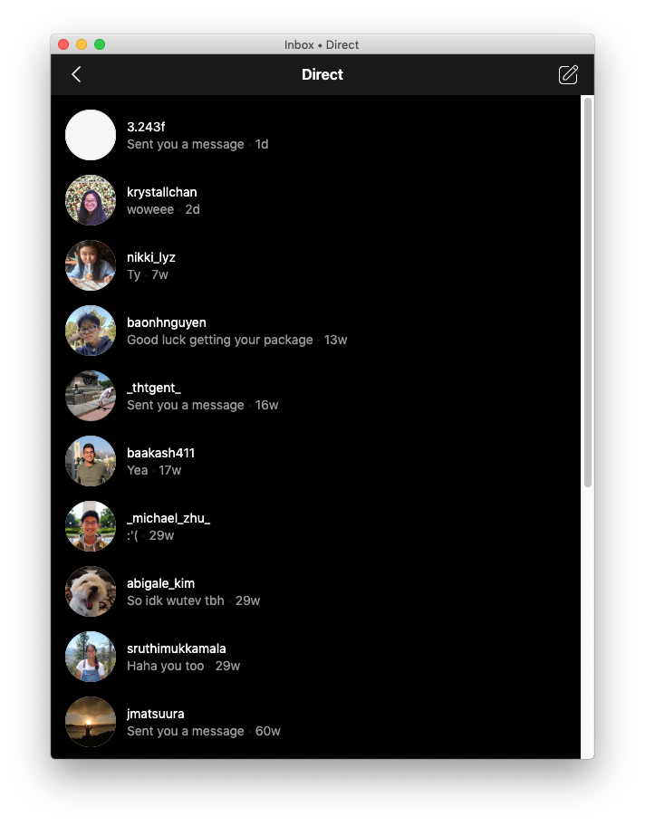

# Cervine

> Instagram Direct desktop app

Cervine is an unofficial Instagram Direct desktop app.

_currently in development_

## About

Cervine is an unofficial Instagram Direct desktop application that supports a dark mode among other future features. Cervine was born out of my frustration of not being able to respond to people on Instagram quickly.

**Why**

[IG:dm](https://igdm.me/) exists but uses Instagram's private API to receive and respond to messages. I found the application slow and somewhat buggy (the UI would sometimes bug out and you could send the wrong person a message).

Cervine **does not use** Instgram's private API. Rather, it simply uses the Instagram website to send/receive messages. This makes it snappy and quick without having to create a brand new UI. To make dark mode, the application simply needs to inject some CSS and JS into the webpage.

_Cervine offers a dark mode_

### Install

_macOS 10.10+, Linux, and Windows 7+ are supported (64-bit only)._

To install, just download the [latest release package](https://github.com/DevinMui/cervine/releases/tag/0.0.1).

**OR**

You can build the application yourself.

Clone the repository

`$ git clone https://github.com/DevinMui/cervine`

Install necessary packages

`$ npm install`

Package the application

`$ npm run dist`

If you would like, you could also package specific targets rather than building every distribution.

`$ npm run pack:<target>`

Replace `<target>` with `osx`, `linux`, `win32`, or `win`.

### Contribute

To contribute to Cervine, clone your fork of Cervine

`$ git clone https://github.com/DevinMui/cervine`

Install necessary packages

`$ npm install`

And run the application

`$ npm start`

When you have finished with your edits, feel free to create a pull request!

### Disclaimer

Cervine is a third-party app and is not affiliated with Facebook or Instagram.
